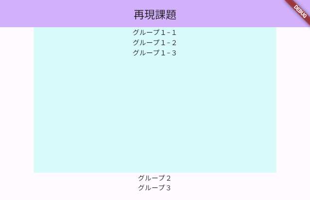

# **Widget復習課題１**

## **①レイアウトを作る**


- [ ] 03_container_column参照

## **②背景色を入れる**


- [ ] 07_property参照

## **③幅と高さをつける**

- 幅500 高さ300


- [ ] 07_property参照

## **④テキストを増やす**



- [ ] 03_container_column参照

## **⑤グループ２と3の背景色、幅と高さをつける**

- 幅500 高さ200
- 背景色好きな色


  
## **⑤グループ２の中に横並びグループを３つ作る**


### **①ソースコード**

```dart

body: Center(
    child: Column(
        children: [
        Container(
            child: Text("グループ１"),
        ),
        Container(
            child: Text("グループ２"),
        ),
        Container(
            child: Text("グループ３"),
        ),
        ],
    ),
),

```
### **②ソースコード**

```dart

body: Center(
    child: Column(
        children: [
        Container(
            decoration: BoxDecoration(
                color: Color.fromARGB(255, 255, 241, 241),
            ),
            child: Text("グループ１"),
        ),
        Container(
            child: Text("グループ２"),
        ),
        Container(
            child: Text("グループ３"),
        ),
        ],
    ),
),

```

### **③ソースコード**

```dart

body: Center(
    child: Column(
        children: [
        Container(
            width: 500,
            height: 300,
            decoration: BoxDecoration(
            color: Color.fromARGB(255, 222, 251, 251),
            ),
            child: Text("グループ１"),
        ),
        Container(
            child: Text("グループ２"),
        ),
        Container(
            child: Text("グループ３"),
        ),
        ],
    ),
),

```

### **④ソースコード**

```dart

body: Center(
    child: Column(
        children: [
        Container(
            width: 500,
            height: 300,
            decoration: BoxDecoration(
            color: Color.fromARGB(255, 222, 251, 251),
            ),
            child: Column(
            children: [
                Text("グループ１−１"),
                Text("グループ１−２"),
                Text("グループ１−３"),
            ],
            ),
        ),
        Container(
            child: Text("グループ２"),
        ),
        Container(
            child: Text("グループ３"),
        ),
        ],
    ),
),

```

### **⑤ソースコード**

```dart

body: Center(
    child: Column(
        children: [
        Container(
            width: 500,
            height: 300,
            decoration: BoxDecoration(
            color: Color.fromARGB(255, 222, 251, 251),
            ),
            child: Column(
            children: [
                Text("グループ１−１"),
                Text("グループ１−２"),
                Text("グループ１−３"),
            ],
            ),
        ),
        Container(
            width: 500,
            height: 200,
            decoration: BoxDecoration(
            color: Color.fromARGB(255, 251, 237, 222),
            ),
            child: Text("グループ２"),
        ),
        Container(
            width: 500,
            height: 200,
            decoration: BoxDecoration(
            color: Color.fromARGB(255, 226, 222, 251),
            ),
            child: Text("グループ３"),
        ),
        ],
    ),
),

```

### **⑥ソースコード**

```dart

body: Center(
    child: Column(
        children: [
        Container(
            width: 500,
            height: 300,
            decoration: BoxDecoration(
            color: Color.fromARGB(255, 222, 251, 251),
            ),
            child: Column(
            children: [
                Text("グループ１−１"),
                Text("グループ１−２"),
                Text("グループ１−３"),
            ],
            ),
        ),
        Container(
            width: 500,
            height: 200,
            decoration: BoxDecoration(
            color: Color.fromARGB(255, 251, 237, 222),
            ),
            child: Row(
                children: [
                    Text("グループ２−１"),
                    Text("グループ２−２"),
                    Text("グループ２−３"),
                ],
            ),
        ),
        Container(
            width: 500,
            height: 200,
            decoration: BoxDecoration(
            color: Color.fromARGB(255, 226, 222, 251),
            ),
            child: Text("グループ３"),
        ),
        ],
    ),
),

```