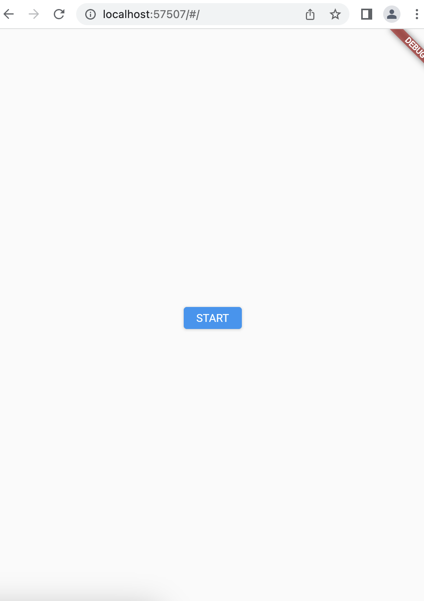

# クイズアプリを作ろう 01

## 01_base

### アプリのベースを作る

#### **【課題】**

- [ ] 新しくプロジェクトを作成
- quizappという名前でディレクトリ、プロジェクトを作成

- [ ] 下記のソースコードを書き写そう
- 使うところ以外は全て消してから、書いていこう
- 既にある「MyApp」以外に「StartPage」と「_StartPageState」という2つのクラスを作ろう

#### **【ポイント】**

- [ ] 画面設計を作ってからコーディングを始めよう
- [ ] プログラムのベースは、既にあるものを利用しよう
- [ ] テーマカラーは、好きな色を設定しよう
- [ ] ダークテーマも設定しよう

#### **【ソースコード】**

```Dart
import 'package:flutter/material.dart';

void main() {
  runApp(const MyApp());
}

class MyApp extends StatelessWidget {
  const MyApp({super.key});

  @override
  Widget build(BuildContext context) {
    return MaterialApp(
      // Colors.この部分 で好きな色を設定しよう
      theme: ThemeData(primarySwatch: Colors.yellow),
      // ダークテーマの設定
      darkTheme: ThemeData(
        brightness: Brightness.dark,
        primarySwatch: Colors.yellow,
      ),
      home: StartPage(),
    );
  }
}

class StartPage extends StatefulWidget {
  const StartPage({Key? key}) : super(key: key);

  @override
  _StartPageState createState() => _StartPageState();
}

class _StartPageState extends State<StartPage> {
  @override
  Widget build(BuildContext context) {
    return Scaffold(
      body: Center(
          child: ElevatedButton(
        onPressed: () {},
        child: Text('START'),
      )),
    );
  }
}
```

#### **【結果】**  

- [ ] 実行して、「START」ボタンが表示されること  


