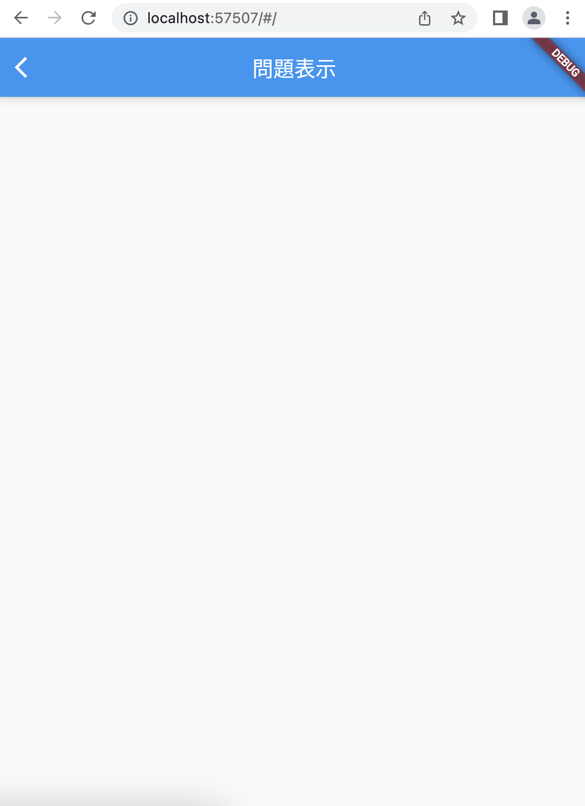

# クイズアプリを作ろう 02

## 02_quizlist

### 出題画面のベースをつくる

#### **【課題】**

- [ ] 出題画面のベースをつくる
- ①ボタンを押したら、クイズリストのページに飛ぶ設定
- ②クイズリスト（QuizListPage）のクラスを追加

#### **【ポイント】**

- 新しい画面を作る時は「class:StatefulWidget」と「class:State<>」をセットで作ることを意識しよう

#### **【ソースコード】**

```Dart
// class StartPageまで省略

class _StartPageState extends State<StartPage> {
  @override
  Widget build(BuildContext context) {
    return Scaffold(
      body: Center(
        child: ElevatedButton(
          onPressed: () {
            // ★①ボタンを押したら、クイズリストのページに飛ぶ設定
            Navigator.of(context).push(
              MaterialPageRoute(
                builder: (context) {
                  return QuizListPage();
                },
              ),
            );
            // ここまで
          },
          child: const Text('START'),
        ),
      ),
    );
  }
}

// ★②クイズリスト（QuizListPage）のクラスを追加
class QuizListPage extends StatefulWidget {
  const QuizListPage({Key? key}) : super(key: key);

  @override
  _QuizListPageState createState() => _QuizListPageState();
}

class _QuizListPageState extends State<QuizListPage> {
  @override
  Widget build(BuildContext context) {
    return Scaffold(
      appBar: AppBar(
        centerTitle: true,
        title: Text('問題'),
      ),
      body: Center(),
    );
  }
}
// ここまで
```

#### **【結果】**  

- [ ] 「STAR」ボタンを押して出題画面に遷移すること  


