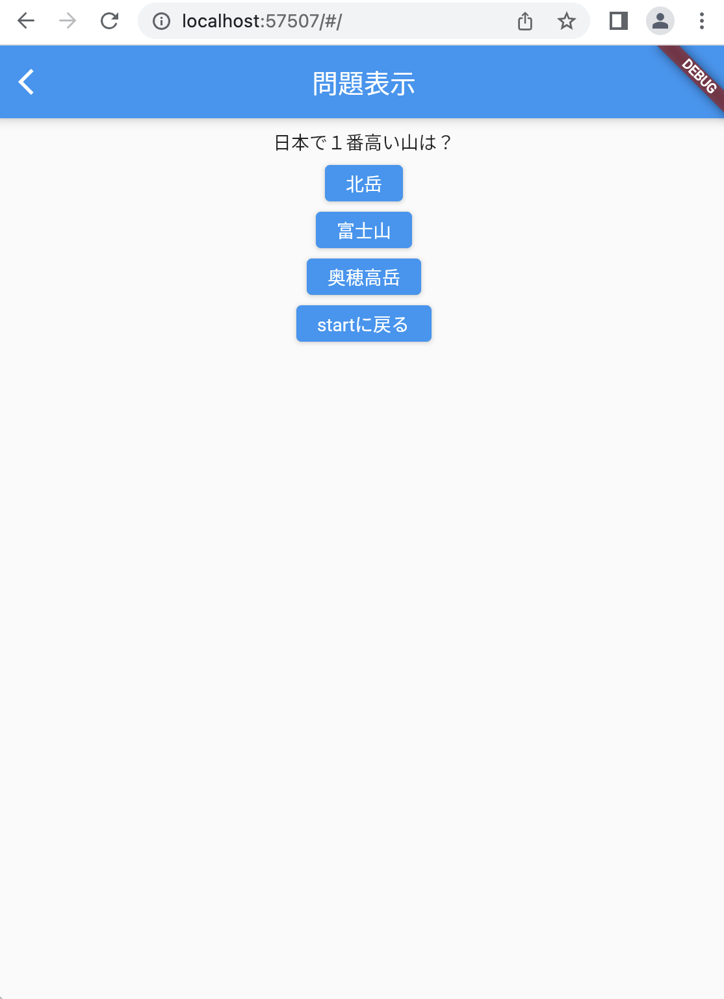

# クイズアプリを作ろう 03

## 03_quizdisplay

### 出題画面にクイズを表示

#### **【課題】**

- [ ] クイズの内容を配列のデータとして作成
- [ ] 配列のデータを画面に表示
- [ ] //★の部分を追加する

#### **【ポイント】**

- listの中にmapデータを作ろう
- まずは1問目のクイズが表示されることを確認しよう

#### **【ソースコード】**

```Dart
class _QuizListPageState extends State<QuizListPage> {
  //★① 変数宣言はclassの下に書く
  //★ ここから↓
  List<Map<String, dynamic>> quilist = [
    {
      "question": "日本で１番高い山は？",
      "answer1": "北岳",
      "answer2": "富士山",
      "answer3": "奥穂高岳",
      "correct": 2            //正解の番号を入れておく、answerの後ろの番号
    },
    {
      "question": "日本で１番長い川は？",
      "answer1": "信濃川",
      "answer2": "利根川",
      "answer3": "石狩川",
      "correct": 1
    },
    {
      "question": "3問目",
      "answer1": "①",
      "answer2": "②",
      "answer3": "③",
      "correct": 1
    },
    {
      "question": "４問目",
      "answer1": "①",
      "answer2": "②",
      "answer3": "③",
      "correct": 2
    },
    {
      "question": "5問目",
      "answer1": "①",
      "answer2": "②",
      "answer3": "③",
      "correct": 0
    },
  ];
  //★ ここから↑

  @override
  Widget build(BuildContext context) {
    return Scaffold(
      appBar: AppBar(
        centerTitle: true,
        title: Text('問題表示'),
      ),
      body: Center(
        //★② 問題文を表示する 配列０番目の問題文を表示
        //★ ここから↓
        child: Column(
          children: [
            const SizedBox(height: 8),
            Text(quilist[0]["question"]),
            const SizedBox(height: 8),
            ElevatedButton(
              onPressed: () {},
              child: Text(quilist[0]["answer1"]),
            ),
            const SizedBox(height: 8),
            ElevatedButton(
              onPressed: () {},
              child: Text(quilist[0]["answer2"]),
            ),
            const SizedBox(height: 8),
            ElevatedButton(
              onPressed: () {},
              child: Text(quilist[0]["answer3"]),
            ),
            const SizedBox(height: 8),
            ElevatedButton(
              //popして前の画面に戻る
              onPressed: Navigator.of(context).pop,
              child: const Text('startに戻る'),
            ),
          ],
        ),
        //★ ここまで↑
      ),
    );
  }
}
```

#### **【結果】**  

- [ ] １問目の情報が表示されること  


