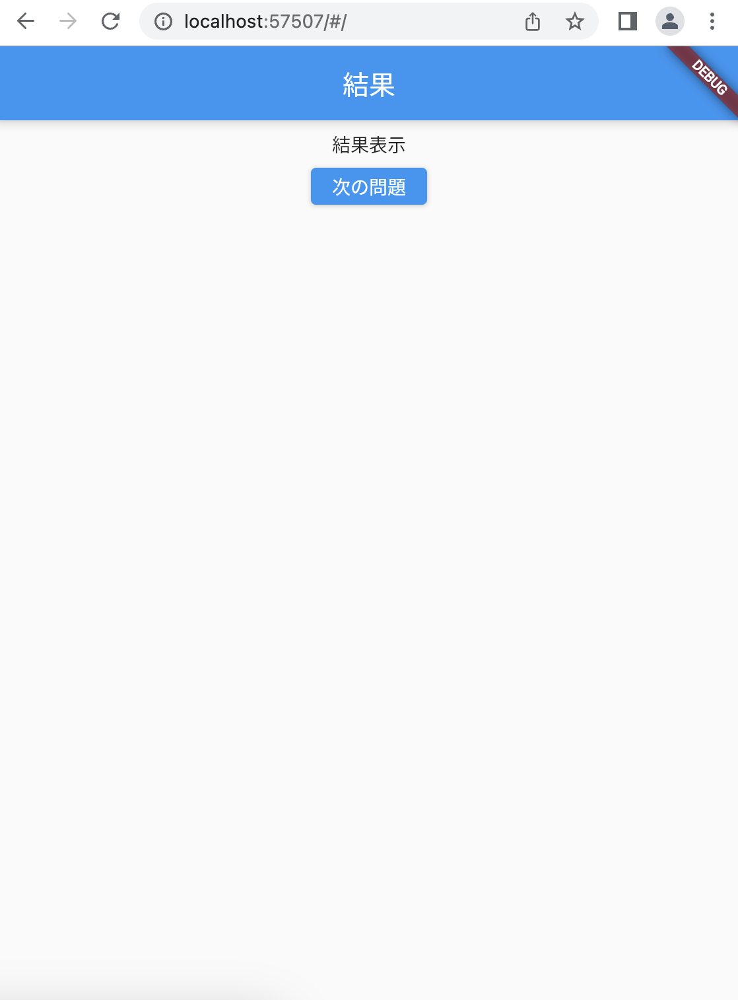

# クイズアプリを作ろう 04

## 04_answer

### 回答結果画面の表示

#### **【課題】**

- [ ] 結果画面のベースを作成
- [ ] 出題画面から画面遷移する
- [ ] //★の部分を追加する

#### **【ポイント】**

- 新しいページを作る時は「class:StatefulWidget」と「class:State<>」を作るところから始めよう
- 　

#### **【ソースコード】**

```Dart
class _QuizListPageState extends State<QuizListPage> {
  List<Map<String, dynamic>> quilist = [
    {
      "question": "日本で１番高い山は？",
      "answer1": "北岳",
      "answer2": "富士山",
      "answer3": "奥穂高岳",
      "correct": 1
    },
    {
      "question": "日本で１番長い川は？",
      "answer1": "信濃川",
      "answer2": "利根川",
      "answer3": "石狩川",
      "correct": 1
    },
    {
      "question": "3問目",
      "answer1": "①",
      "answer2": "②",
      "answer3": "③",
      "correct": 1
    },
    {
      "question": "４問目",
      "answer1": "①",
      "answer2": "②",
      "answer3": "③",
      "correct": 2
    },
    {
      "question": "5問目",
      "answer1": "①",
      "answer2": "②",
      "answer3": "③",
      "correct": 0
    },
  ];

  @override
  Widget build(BuildContext context) {
    return Scaffold(
      appBar: AppBar(
        centerTitle: true,
        title: Text('問題表示'),
      ),
      body: Center(
        child: Column(
          children: [
            const SizedBox(height: 8),
            Text(quilist[0]["question"]),
            const SizedBox(height: 8),
            ElevatedButton(
              onPressed: () {
                //★① 結果画面へ画面遷移
                //★ ここから↓
                Navigator.of(context).push(
                  MaterialPageRoute(
                    builder: (context) {
                      return AnswerPage();
                    },
                  ),
                );
                //★ ここまで↑
              },
              child: Text(quilist[0]["answer1"]),
            ),
            const SizedBox(height: 8),
            ElevatedButton(
              onPressed: () {
                //★② 結果画面へ画面遷移
                //★ ①で追加したものコピペでOK↓
                Navigator.of(context).push(
                  MaterialPageRoute(
                    builder: (context) {
                      return AnswerPage();
                    },
                  ),
                );
                //★ ここまで↑
              },
              child: Text(quilist[0]["answer2"]),
            ),
            const SizedBox(height: 8),
            ElevatedButton(
              onPressed: () {
                //★② 結果画面へ画面遷移
                //★ ①で追加したものコピペでOK↓
                Navigator.of(context).push(
                  MaterialPageRoute(
                    builder: (context) {
                      return AnswerPage();
                    },
                  ),
                );
                //★ ここまで↑
              },
              child: Text(quilist[0]["answer3"]),
            ),
            const SizedBox(height: 8),
            ElevatedButton(
              onPressed: Navigator.of(context).pop,
              child: const Text('startに戻る'),
            ),
          ],
        ),
      ),
    );
  }
}

//★③ 結果画面のベースを作る
//★ ここから↓
class AnswerPage extends StatefulWidget {
  @override
  _AnswerPageState createState() => _AnswerPageState();
}

class _AnswerPageState extends State<AnswerPage> {
  @override
  Widget build(BuildContext context) {
    return Scaffold(
      appBar: AppBar(
        title: Text('結果'),
        automaticallyImplyLeading: false,
      ),
      body: Center(
        child: Column(
          children: [
            const SizedBox(height: 8),
            Text('結果表示'),
            const SizedBox(height: 8),
            ElevatedButton(
              onPressed: () {},
              child: Text('次の問題'),
            ),
          ],
        ),
      ),
    );
  }
}
//★ ここまで↑
```

#### **【結果】**  

- [ ] 回答ボタンを押した時、結果画面に遷移する


