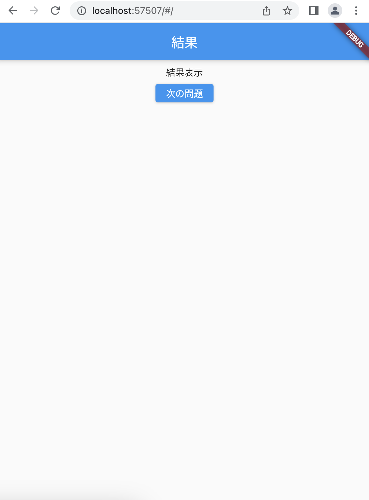

# クイズアプリを作ろう 04

## 04_answer

### 回答結果画面の表示

#### **【課題】**

- [ ] 結果画面のベースを作成
- [ ] 出題画面から画面遷移する
- [ ] //★の部分を追加する

#### **【ポイント】**

- 新しいページを作る時は「class:StatefulWidget」と「class:State<>」を作るところから始めよう
- 　

#### **【ソースコード】**

```Dart
// QuizListPage までは省略

class _QuizListPageState extends State<QuizListPage> {
  List<Map<String, dynamic>> quilist = [
    // 中身省略
  ];

  @override
  Widget build(BuildContext context) {
    return Scaffold(
      appBar: AppBar(
        centerTitle: true,
        title: Text('問題'),
      ),
      body: Center(
        child: Column(children: [
          Container(
            padding: EdgeInsets.all(30.0),
            child: Text(quizlist[0]["question"]),
          ),
          Row(
            mainAxisAlignment: MainAxisAlignment.spaceEvenly,
            children: [
              ElevatedButton(
                  // ★①onPressedの{}の中身を記入(同じものなのでコピペでOK)
                  onPressed: () {
                    Navigator.of(context).push(
                      MaterialPageRoute(
                        builder: (context) {
                          return AnswerPage();
                        },
                      ),
                    );
                    // ここまで
                  },
                  child: Text(quizlist[0]["answer1"])),
              ElevatedButton(
                  onPressed: () {
                    Navigator.of(context).push(
                      MaterialPageRoute(
                        builder: (context) {
                          return AnswerPage();
                        },
                      ),
                    );
                  },
                  child: Text(quizlist[0]["answer2"])),
              ElevatedButton(
                  onPressed: () {
                    Navigator.of(context).push(
                      MaterialPageRoute(
                        builder: (context) {
                          return AnswerPage();
                        },
                      ),
                    );
                  },
                  child: Text(quizlist[0]["answer3"])),
            ],
          ),
          Container(
            padding: EdgeInsets.only(top: 50),
            child: TextButton(
              onPressed: Navigator.of(context).pop,
              child: Text('STARTに戻る'),
            ),
          )
        ]),
      ),
    );
  }
}

// ★②結果画面を作る

class AnswerPage extends StatefulWidget {
  const AnswerPage({Key? key}) : super(key: key);

  @override
  _AnswerPageState createState() => _AnswerPageState();
}

class _AnswerPageState extends State<AnswerPage> {
  @override
  Widget build(BuildContext context) {
    return Scaffold(
        appBar: AppBar(
          title: Text('結果'),
          automaticallyImplyLeading: false, // 戻るボタンを削除
        ),
        body: Center(
          child: Column(
            children: [
              Padding(
                padding: const EdgeInsets.all(30.0),
                child: Text('結果'),
              ),
              ElevatedButton(
                onPressed: () {},
                child: Text('次の問題'),
              )
            ],
          ),
        ));
  }
}

// ここまで
```

#### **【結果】**  

- [ ] 回答ボタンを押した時、結果画面に遷移する


