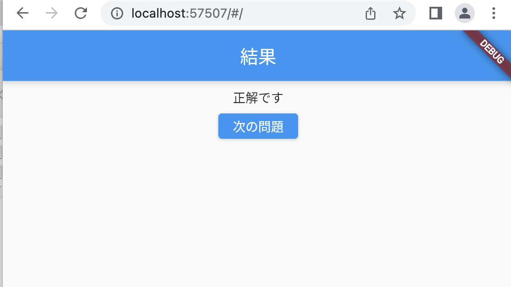
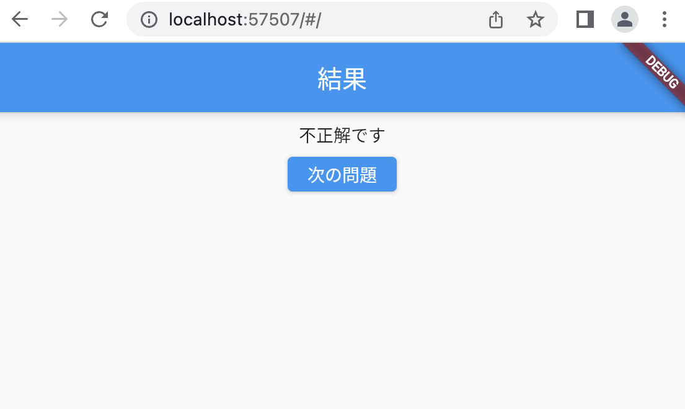

# クイズアプリを作ろう 05

## 05_hantei

### 正解不正解の判定処理

#### **【課題】**

- [ ] ①check関数を作る 正解か不正解かの判定用
- [ ] ②check関数を使用
- [ ] ③const AnswerPage({Key? key}) : super(key: key);を消す
- [ ] ④QuizListPageから受け取ったbool値を、AnswerPageで使える状態にする
- [ ] ⑤結果を表示するWidgetの関数を作成
- [ ] ⑥Text('結果')を削除し、作った関数を記入
- [ ] //★の部分を追加する

#### **【ポイント】**

- 画面間のデータの流れを理解しよう
- 　

#### **【ソースコード】**

```Dart

// QuizListPage まで省略

class _QuizListPageState extends State<QuizListPage> {
  // ★①check関数を作る
  bool check(num) {
    bool _result = true;

    if (quizlist[0]["correct"] == num) {
      _result = true;
    } else {
      _result = false;
    }

    return _result;
  }

  List<Map<String, dynamic>> quizlist = [
    // 中身省略
  ];

  @override
  Widget build(BuildContext context) {
    return Scaffold(
      appBar: AppBar(
        centerTitle: true,
        title: Text('問題'),
      ),
      body: Center(
        child: Column(children: [
          Container(
            padding: EdgeInsets.all(30.0),
            child: Text(quizlist[0]["question"]),
          ),
          Row(
            mainAxisAlignment: MainAxisAlignment.spaceEvenly,
            children: [
              ElevatedButton(
                  onPressed: () {
                    Navigator.of(context).push(
                      MaterialPageRoute(
                        builder: (context) {
                          // ★②check関数を使用
                          return AnswerPage(check(1));
                        },
                      ),
                    );
                  },
                  child: Text(quizlist[0]["answer1"])),
              ElevatedButton(
                  onPressed: () {
                    Navigator.of(context).push(
                      MaterialPageRoute(
                        builder: (context) {
                          // ★②check関数を使用
                          return AnswerPage(check(2));
                        },
                      ),
                    );
                  },
                  child: Text(quizlist[0]["answer2"])),
              ElevatedButton(
                  onPressed: () {
                    Navigator.of(context).push(
                      MaterialPageRoute(
                        builder: (context) {
                          // ★②check関数を使用
                          return AnswerPage(check(3));
                        },
                      ),
                    );
                  },
                  child: Text(quizlist[0]["answer3"])),
            ],
          ),
          Container(
            padding: EdgeInsets.only(top: 50),
            child: TextButton(
              onPressed: Navigator.of(context).pop,
              child: Text('STARTに戻る'),
            ),
          )
        ]),
      ),
    );
  }
}


class AnswerPage extends StatefulWidget {
  // ★③const AnswerPage({Key? key}) : super(key: key);を消す
  // ★④QuizListPageから受け取ったbool値を、AnswerPageで使える状態にする
  AnswerPage(this._result);
  bool _result;

  @override
  _AnswerPageState createState() => _AnswerPageState();
}

class _AnswerPageState extends State<AnswerPage> {
  
  // ★⑤結果を表示するWidgetの関数を作成
  Widget _resultText() {
    String _text = '';

    if (widget._result == true) {
      _text = '正解です！';
    } else {
      _text = '不正解です…';
    }

    return Text(_text);
  }

  @override
  Widget build(BuildContext context) {
    return Scaffold(
        appBar: AppBar(
          title: Text('結果'),
          automaticallyImplyLeading: false, // 戻るボタンを削除
        ),
        body: Center(
          child: Column(
            children: [
              Padding(
                padding: const EdgeInsets.all(30.0),
                // ★⑥Text('結果')を削除し、作った関数を記入
                child: _resultText(),
              ),
              ElevatedButton(
                onPressed: () {},
                child: Text('次の問題'),
              )
            ],
          ),
        ));
  }
}
```

#### **【結果】**  

- [ ] 正解の場合「正解です」不正解の場合「不正解です」の文字が切り替わる



