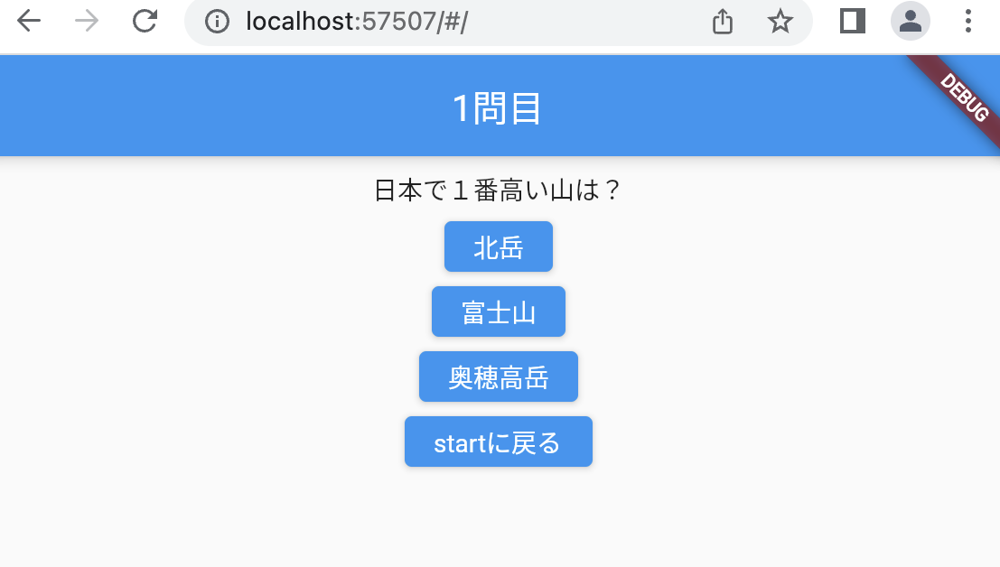

# クイズアプリを作ろう 06

## 06_nextquetion

### 次の問題に切り替える

#### **【課題】**

- [ ] ①問題番号用の変数を宣言する_answercnt
- [ ] ②配列のindex番号に変数を使用する
- [ ] ③表示用の問題番号用の変数を宣言する_answerdisp
- [ ] ④タイトルを_answerdispから表示する
- [ ] ⑤AppBerの戻るボタンを非表示にする
- [ ] //★の部分を追加する

#### **【ポイント】**

- 出題は全て、QuizListPage画面を使用する
- 変数_answercntの値により問題を切り替える

#### **【ソースコード】**

```Dart
class _QuizListPageState extends State<QuizListPage> {
  bool _kekka = true; //正解：true 不正解：false
  //★①　変数宣言
  int _answercnt = 0; //何問目かListのindexに使用
  //★③　変数宣言
  int _answerdisp = 1; //何問目か表示用

  List<Map<String, dynamic>> quilist = [
    {
      "question": "日本で１番高い山は？",
      "answer1": "北岳",
      "answer2": "富士山",
      "answer3": "奥穂高岳",
      "correct": 2
    },
    {
      "question": "日本で１番長い川は？",
      "answer1": "信濃川",
      "answer2": "利根川",
      "answer3": "石狩川",
      "correct": 1
    },
    {
      "question": "3問目",
      "answer1": "①",
      "answer2": "②",
      "answer3": "③",
      "correct": 1
    },
    {
      "question": "４問目",
      "answer1": "①",
      "answer2": "②",
      "answer3": "③",
      "correct": 2
    },
    {
      "question": "5問目",
      "answer1": "①",
      "answer2": "②",
      "answer3": "③",
      "correct": 0
    },
  ];

  @override
  Widget build(BuildContext context) {
    return Scaffold(
      appBar: AppBar(
        centerTitle: true,
        //★④
        //title: Text('問題表示'),を削除
        title: Text('$_answerdisp問目'), //何問目かタイトルに表示
        //★⑤
        automaticallyImplyLeading: false, //AppBerの戻るボタンは非表示
      ),
      body: Center(
        child: Column(
          children: [
            const SizedBox(height: 8),
            //★② ０→_answercnt
            Text(quilist[_answercnt]["question"]),
            const SizedBox(height: 8),
            ElevatedButton(
              onPressed: () {
                // 正解不正解の判定 正解:true 不正解:false
                // １番のボタンが正解の場合は「correct」の値が１
                //★② ０→_answercnt
                if (quilist[_answercnt]["correct"] == 1) {
                  _kekka = true;
                } else {
                  _kekka = false;
                }
                Navigator.of(context).push(
                  MaterialPageRoute(
                    builder: (context) {
                      // _kekkaを次の画面へ渡す
                      return AnswerPage(_kekka);
                    },
                  ),
                );
              },
              //★② ０→_answercnt
              child: Text(quilist[_answercnt]["answer1"]),
            ),
            const SizedBox(height: 8),
            ElevatedButton(
              onPressed: () {
                // ２番のボタンが正解の場合は「correct」の値が２
                //★② ０→_answercnt
                if (quilist[_answercnt]["correct"] == 2) {
                  _kekka = true;
                } else {
                  _kekka = false;
                }
                Navigator.of(context).push(
                  MaterialPageRoute(
                    builder: (context) {
                      // _kekkaを次の画面へ渡す
                      return AnswerPage(_kekka);
                    },
                  ),
                );
              },
              //★② ０→_answercnt
              child: Text(quilist[_answercnt]["answer2"]),
            ),
            const SizedBox(height: 8),
            ElevatedButton(
              onPressed: () {
                // 3番のボタンが正解の場合は「correct」の値が3
                //★②
                if (quilist[_answercnt]["correct"] == 3) {
                  _kekka = true;
                } else {
                  _kekka = false;
                }
                Navigator.of(context).push(
                  MaterialPageRoute(
                    builder: (context) {
                      // _kekkaを次の画面へ渡す
                      return AnswerPage(_kekka);
                    },
                  ),
                );
              },
              //★② ０→_answercnt
              child: Text(quilist[_answercnt]["answer3"]),
            ),
            const SizedBox(height: 8),
            ElevatedButton(
              onPressed: Navigator.of(context).pop,
              child: const Text('startに戻る'),
            ),
          ],
        ),
      ),
    );
  }
}
```

#### **【結果】**  

- [ ] １問目が表示され、回答により結果表示が変わること
- [ ] タイトルが１問目になっていること


