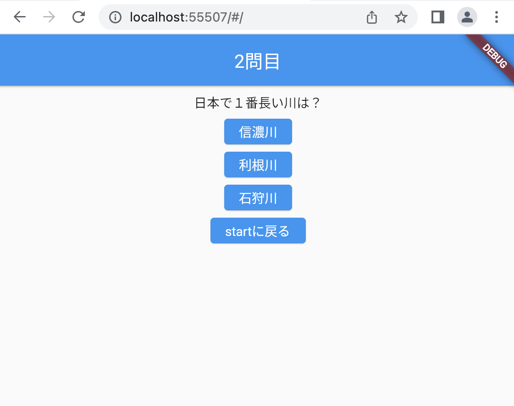

# クイズアプリを作ろう 07

## 07_nextquetion2

### 次の問題に切り替える

#### **【課題】**

- [ ] ①_answerdisp(問題番号)をAnswerPage（結果画面）に渡す
- [ ] ②AnswerPage（結果画面）で受け取る
- [ ] ③AnswerPage（結果画面）で「次の問題」ボタンが押されたら、出題画面にPOPで戻る
- [ ] ④出題画面に戻り、次の問題を表示する
- [ ] //★の部分を追加する

#### **【ポイント】**

- setStateで変数_answercntをカウントアップし画面を再読み込みする

#### **【ソースコード】**

```Dart
class _QuizListPageState extends State<QuizListPage> {
  bool _kekka = true; //正解：true 不正解：false
  int _answercnt = 0; //何問目かListのindexに使用
  int _answerdisp = 1; //何問目か表示用

  List<Map<String, dynamic>> quilist = [
    {
      "question": "日本で１番高い山は？",
      "answer1": "北岳",
      "answer2": "富士山",
      "answer3": "奥穂高岳",
      "correct": 2
    },
    {
      "question": "日本で１番長い川は？",
      "answer1": "信濃川",
      "answer2": "利根川",
      "answer3": "石狩川",
      "correct": 1
    },
    {
      "question": "3問目",
      "answer1": "①",
      "answer2": "②",
      "answer3": "③",
      "correct": 1
    },
    {
      "question": "４問目",
      "answer1": "①",
      "answer2": "②",
      "answer3": "③",
      "correct": 2
    },
    {
      "question": "5問目",
      "answer1": "①",
      "answer2": "②",
      "answer3": "③",
      "correct": 0
    },
  ];

  @override
  Widget build(BuildContext context) {
    return Scaffold(
      appBar: AppBar(
        centerTitle: true,
        title: Text('$_answerdisp問目'),
        automaticallyImplyLeading: false,
      ),
      body: Center(
        child: Column(
          children: [
            const SizedBox(height: 8),
            Text(quilist[_answercnt]["question"]),
            const SizedBox(height: 8),
            ElevatedButton(
              //★④ 結果画面で「次の問題」ボタンが押された時の戻り処理
              //★④ 非同期処理　 async
              onPressed: () async {
                if (quilist[_answercnt]["correct"] == 1) {
                  _kekka = true;
                } else {
                  _kekka = false;
                }
                //★④ AnswerPage からの戻り値をreturnTextに
                //★④ awaitで戻ってくるまで、次の処理が実行されないようにする
                //final returnText = await を　Navigetorの前につける
                final returnText = await Navigator.of(context).push(
                  MaterialPageRoute(
                    builder: (context) {
                      //★① 引数に「_answerdisp」を追加
                      return AnswerPage(_kekka, _answerdisp);
                    },
                  ),
                );
                //★④ AnswerPageから戻り値がある場合が次の問題にカウントアップ
                //★④ AppBerから戻った場合はここは通らない（問題のカウントアップをしないので次の問題に切り替わらない）
                //ここから↓
                if (returnText != null) {
                  //カウントアップした後再読み込み
                  setState(() {
                    _answercnt++;
                    _answerdisp++;
                  });
                }
                //ここまで↑
              },
              child: Text(quilist[_answercnt]["answer1"]),
            ),
            const SizedBox(height: 8),
            ElevatedButton(
              //★④ 他のボタンも同様に修正
              onPressed: () async {
                if (quilist[_answercnt]["correct"] == 2) {
                  _kekka = true;
                } else {
                  _kekka = false;
                }
                //★④ 他のボタンも同様に修正
                final returnText = await Navigator.of(context).push(
                  MaterialPageRoute(
                    builder: (context) {
                      //★① 引数に「_answerdisp」を追加
                      return AnswerPage(_kekka, _answerdisp);
                    },
                  ),
                );
                //★④ 他のボタンも同様に修正
                if (returnText != null) {
                  //カウントアップした後再読み込み
                  setState(() {
                    _answercnt++;
                    _answerdisp++;
                  });
                }
              },
              child: Text(quilist[_answercnt]["answer2"]),
            ),
            const SizedBox(height: 8),
            ElevatedButton(
              //★④ 他のボタンも同様に修正
              onPressed: () async {
                if (quilist[_answercnt]["correct"] == 3) {
                  _kekka = true;
                } else {
                  _kekka = false;
                }
                //★④ 他のボタンも同様に修正
                final returnText = await Navigator.of(context).push(
                  MaterialPageRoute(
                    builder: (context) {
                      //★① 引数に「_answerdisp」を追加
                      return AnswerPage(_kekka, _answerdisp);
                    },
                  ),
                );
                //★④ 他のボタンも同様に修正
                if (returnText != null) {
                  //カウントアップした後再読み込み
                  setState(() {
                    _answercnt++;
                    _answerdisp++;
                  });
                }
              },
              child: Text(quilist[_answercnt]["answer3"]),
            ),
            const SizedBox(height: 8),
            ElevatedButton(
              onPressed: Navigator.of(context).pop,
              child: const Text('startに戻る'),
            ),
          ],
        ),
      ),
    );
  }
}

class AnswerPage extends StatefulWidget {
  // ★② 引数追加
  AnswerPage(this._kekka, this._answerdisp);
  bool _kekka;
  // ★②
  int _answerdisp;

  @override
  _AnswerPageState createState() => _AnswerPageState();
}

class _AnswerPageState extends State<AnswerPage> {
  //----- 正解不正解表示　-----
  Widget _kekkaText() {
    if (widget._kekka) {
      return Text('正解です');
    } else {
      return Text('不正解です');
    }
  }

  @override
  Widget build(BuildContext context) {
    return Scaffold(
      appBar: AppBar(
        title: Text('結果'),
        automaticallyImplyLeading: false,
      ),
      body: Center(
        child: Column(
          children: [
            const SizedBox(height: 8),
            _kekkaText(),
            const SizedBox(height: 8),
            ElevatedButton(
              onPressed: () {
                // ★③ 「次の問題」ボタンが押された時に何問目かを前の画面に戻す
                Navigator.of(context).pop(widget._answerdisp);
              },
              child: Text('次の問題'),
            ),
          ],
        ),
      ),
    );
  }
}
```

#### **【結果】**  

- [ ] 2問目が表示されること
- [ ] タイトルが2問目になっていること


