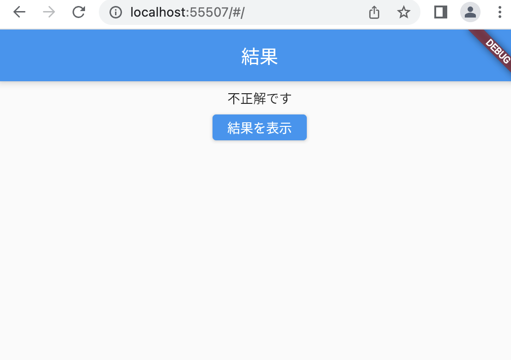

# クイズアプリを作ろう 08

## 08_diapchange

### 最終問題の表示切り替え

#### **【課題】**

- [ ] ①最終問題かどうか調べ、最終問題の場合は②AnswerPage（結果画面）のボタン表示を「結果を表示」に切り替える
- [ ] ②「結果を表示」ボタンが押されたら、KekkaPage（総合結果画面）に遷移する
- [ ] //★の部分を追加する

#### **【ポイント】**

- 変数_answerdispの値で最終問題かどうか判断する

#### **【ソースコード】**

```Dart
class AnswerPage extends StatefulWidget {
  AnswerPage(this._kekka, this._answerdisp);
  bool _kekka;
  int _answerdisp;

  @override
  _AnswerPageState createState() => _AnswerPageState();
}

class _AnswerPageState extends State<AnswerPage> {
  //----- 正解不正解表示　-----
  Widget _kekkaText() {
    if (widget._kekka) {
      return Text('正解です');
    } else {
      return Text('不正解です');
    }
  }

  //----- ボタンの表示を切り替える -----
  //★②最終問題のときは「結果を表示」とする
  //ここから↓
  Widget _buttonText() {
    if (widget._answerdisp < 5) {
      return Text('次の問題');
    } else {
      return Text('結果を表示');
    }
  }
  //ここまで↑


  @override
  Widget build(BuildContext context) {
    return Scaffold(
      appBar: AppBar(
        title: Text('結果'),
        automaticallyImplyLeading: false,
      ),
      body: Center(
        child: Column(
          children: [
            const SizedBox(height: 8),
            _kekkaText(),
            const SizedBox(height: 8),
            ElevatedButton(
              onPressed: () {
                //★③　　最終問題の場合はKekkaPageに画面遷移
                //Navigator.of(context).pop(widget._answerdisp);
                //ここから↓
                if (widget._answerdisp < 5) {
                  //前画面へ戻る（何問目かを返す）
                  Navigator.of(context).pop(widget._answerdisp);
                } else {
                  // 最終問題の場合　結果画面へ遷移
                  Navigator.of(context).push(
                    MaterialPageRoute(
                      builder: (context) {
                        return KekkaPage();
                      },
                    ),
                  );
                }
                //ここまで↑
              },
              //★①　ボタンの文字を切り替える　関数を作成
              //child: Text('次の問題'),削除
              child: _buttonText(),
            ),
          ],
        ),
      ),
    );
  }
}

//★④ 結果画面を追加
//ここから↓
class KekkaPage extends StatefulWidget {
  const KekkaPage({super.key});

  @override
  _KekkaPageState createState() => _KekkaPageState();
}

class _KekkaPageState extends State<KekkaPage> {
  @override
  Widget build(BuildContext context) {
    return Scaffold(
      appBar: AppBar(
        title: Text('総合結果'),
        automaticallyImplyLeading: false,
      ),
      body: Center(),
    );
  }
}
//ここまで↑
```

#### **【結果】**  

- [ ] 最終問題の場合「結果を表示」ボタンに切り替わること
- [ ] 「結果を表示」ボタンを押したとき、総合結果画面に遷移すること



