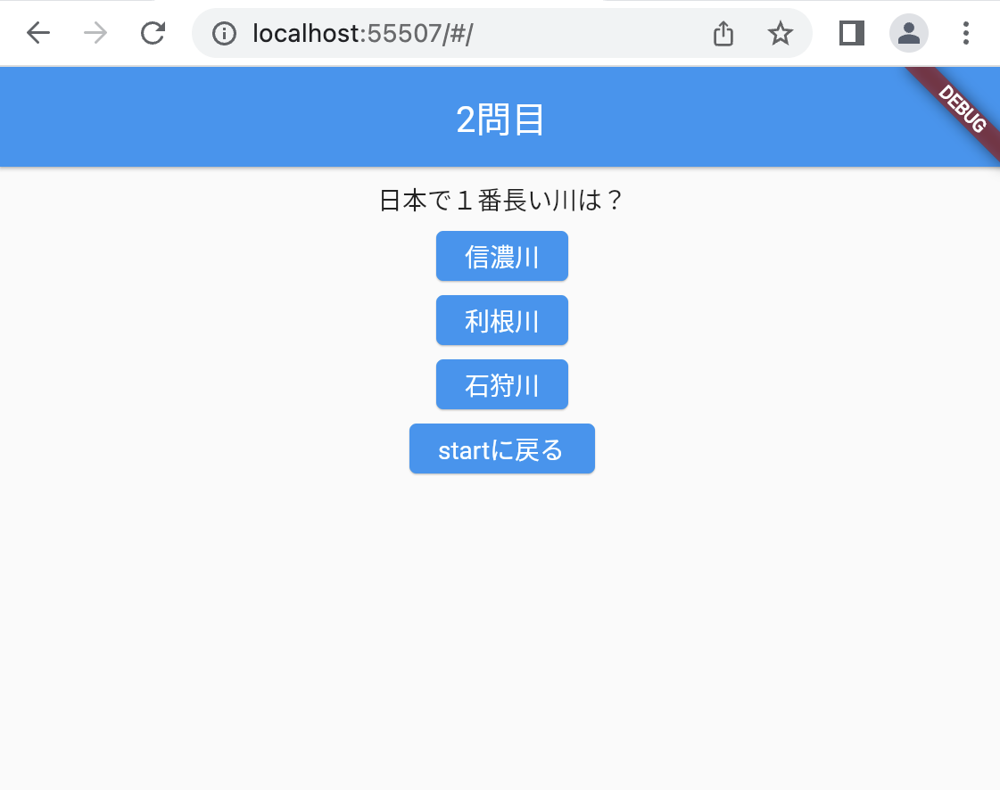

# クイズアプリを作ろう 07

## 07_nextquetion2

### 次の問題に切り替える

#### **【課題】**

- [ ] ①AnswerPageで受け取る引数を追加（AnswerPage内）
- [ ] ②AnswerPageで使う「何問目か」の変数を設定（AnswerPage内）
- [ ] ③{}の中に「次の問題」ボタンが押されたら、今何問目か？を返す処理を書く（_AnswerPageState内）
- [ ] ④onPressed()の後に「async」をつける（_QuizListPageState内、全てのElevatedButtonに同じ処理）
- [ ] ⑤Navigator.of〜の前に final returnText = await をつける_QuizListPageState内、全てのElevatedButtonに同じ処理）
- [ ] ⑥AnswerPageの引数に _quiznum を追加_QuizListPageState内、全てのElevatedButtonに同じ処理）
- [ ] ⑦_answercntと_quiznumをプラスする処理を書く_QuizListPageState内、全てのElevatedButtonに同じ処理）
- [ ] //★の部分を追加する

#### **【ポイント】**

- setStateで変数_answercntをカウントアップし画面を再読み込みする

#### **【ソースコード】**

```Dart

// QuizListPageまで省略
class _QuizListPageState extends State<QuizListPage> {
  int _answercnt = 0;
  int _quiznum = 1;

  bool check(num) {
    bool _result = true;

    if (quizlist[_answercnt]["correct"] == num) {
      _result = true;
    } else {
      _result = false;
    }

    return _result;
  }

  List<Map<String, dynamic>> quizlist = [
    // 内容省略
  ];

  @override
  Widget build(BuildContext context) {
    return Scaffold(
      appBar: AppBar(
        centerTitle: true,
        title: Text('$_quiznum問目'),
        automaticallyImplyLeading: false,
      ),
      body: Center(
        child: Column(children: [
          Container(
            padding: EdgeInsets.all(30.0),
            child: Text(quizlist[_answercnt]["question"]),
          ),
          Row(
            mainAxisAlignment: MainAxisAlignment.spaceEvenly,
            children: [
              ElevatedButton(
                  // ★④onPressed()の後に「async」をつける
                  onPressed: () async {
                    // ★⑤Navigator.of〜の前に final returnText = await をつける
                    final returnText = await Navigator.of(context).push(
                      MaterialPageRoute(
                        builder: (context) {
                          // ★⑥AnswerPageの引数に _quiznum を追加
                          return AnswerPage(check(1), _quiznum);
                        },
                      ),
                    );
                    // ★⑦_answercntと_quiznumをプラスする処理を書く
                    if (returnText != null) {
                      setState(() {
                        _answercnt++;
                        _quiznum++;
                      });
                    }
                  },
                  child: Text(quizlist[_answercnt]["answer1"])),
              ElevatedButton(
                  // ★
                  onPressed: () async {
                    final returnText = await Navigator.of(context).push(
                      MaterialPageRoute(
                        builder: (context) {
                          return AnswerPage(check(2), _quiznum);
                        },
                      ),
                    );
                    if (returnText != null) {
                      setState(() {
                        _answercnt++;
                        _quiznum++;
                      });
                    }
                  },
                  child: Text(quizlist[_answercnt]["answer2"])),
              ElevatedButton(
                  onPressed: () async {
                    final returnText = await Navigator.of(context).push(
                      MaterialPageRoute(
                        builder: (context) {
                          return AnswerPage(check(3), _quiznum);
                        },
                      ),
                    );
                    if (returnText != null) {
                      setState(() {
                        _answercnt++;
                        _quiznum++;
                      });
                    }
                  },
                  child: Text(quizlist[_answercnt]["answer3"])),
            ],
          ),
          Container(
            padding: EdgeInsets.only(top: 50),
            child: TextButton(
              onPressed: Navigator.of(context).pop,
              child: Text('STARTに戻る'),
            ),
          )
        ]),
      ),
    );
  }
}

class AnswerPage extends StatefulWidget {
  // ★①AnswerPageで受け取る引数を追加
  AnswerPage(this._result, this._quiznum);
  bool _result;
  // ★②AnswerPageで使う「何問目か」の変数を設定
  int _quiznum;
  @override
  _AnswerPageState createState() => _AnswerPageState();
}

class _AnswerPageState extends State<AnswerPage> {
  Widget _resultText() {
    String _text = '';

    if (widget._result == true) {
      _text = '正解です！';
    } else {
      _text = '不正解です…';
    }

    return Text(_text);
  }

  @override
  Widget build(BuildContext context) {
    return Scaffold(
        appBar: AppBar(
          title: Text('結果'),
          automaticallyImplyLeading: false,
        ),
        body: Center(
          child: Column(
            children: [
              Padding(
                padding: const EdgeInsets.all(30.0),
                child: _resultText(),
              ),
              ElevatedButton(
                // ★③{}の中に「次の問題」ボタンが押されたら、今何問目か？を返す処理を書く
                onPressed: () {
                  Navigator.of(context).pop(widget._quiznum);
                },
                child: Text('次の問題'),
              )
            ],
          ),
        ));
  }
}

```

#### **【結果】**  

- [ ] 2問目が表示されること
- [ ] タイトルが2問目になっていること


