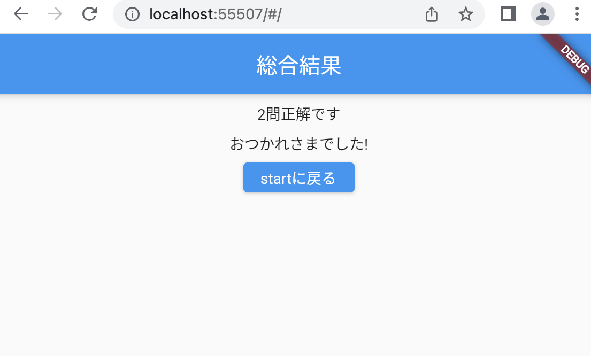

# クイズアプリを作ろう 09

## 09_kekkapage

### 総合結果画面

#### **【課題】**

- [ ] ①正解した数をカウントし、総合結果画面に渡す
- [ ] ②
- [ ] //★の部分を追加する

#### **【ポイント】**

- 変数_answerdispの値で最終問題かどうか判断する

#### **【ソースコード】**

```Dart
class _QuizListPageState extends State<QuizListPage> {
  bool _kekka = true; //正解：true 不正解：false
  int _answercnt = 0; //何問目かListのindexに使用
  int _answerdisp = 1; //何問目か表示用
  //★① 正解数をカウントする変数宣言
  int _seikaicnt = 0; //正解した数をカウント

  List<Map<String, dynamic>> quilist = [
    {
      "question": "日本で１番高い山は？",
      "answer1": "北岳",
      "answer2": "富士山",
      "answer3": "奥穂高岳",
      "correct": 2
    },
    {
      "question": "日本で１番長い川は？",
      "answer1": "信濃川",
      "answer2": "利根川",
      "answer3": "石狩川",
      "correct": 1
    },
    {
      "question": "3問目",
      "answer1": "①",
      "answer2": "②",
      "answer3": "③",
      "correct": 1
    },
    {
      "question": "４問目",
      "answer1": "①",
      "answer2": "②",
      "answer3": "③",
      "correct": 2
    },
    {
      "question": "5問目",
      "answer1": "①",
      "answer2": "②",
      "answer3": "③",
      "correct": 0
    },
  ];

  @override
  Widget build(BuildContext context) {
    return Scaffold(
      appBar: AppBar(
        centerTitle: true,
        title: Text('$_answerdisp問目'),
        automaticallyImplyLeading: false,
      ),
      body: Center(
        child: Column(
          children: [
            const SizedBox(height: 8),
            Text(quilist[_answercnt]["question"]),
            const SizedBox(height: 8),
            ElevatedButton(
              onPressed: () async {
                if (quilist[_answercnt]["correct"] == 1) {
                  _kekka = true;
                  //★② 正解数をカウントする
                  _seikaicnt++;
                } else {
                  _kekka = false;
                }
                final returnText = await Navigator.of(context).push(
                  MaterialPageRoute(
                    builder: (context) {
                      //★③ 正解数を引数で渡す
                      return AnswerPage(_kekka, _answerdisp, _seikaicnt);
                    },
                  ),
                );
                if (returnText != null) {
                  //カウントアップした後再読み込み
                  setState(() {
                    _answercnt++;
                    _answerdisp++;
                  });
                }
              },
              child: Text(quilist[_answercnt]["answer1"]),
            ),
            const SizedBox(height: 8),
            ElevatedButton(
              onPressed: () async {
                if (quilist[_answercnt]["correct"] == 2) {
                  _kekka = true;
                  //★② 正解数をカウントする
                  _seikaicnt++;
                } else {
                  _kekka = false;
                }
                final returnText = await Navigator.of(context).push(
                  MaterialPageRoute(
                    builder: (context) {
                      //★③ 正解数を引数で渡す
                      return AnswerPage(_kekka, _answerdisp, _seikaicnt);
                    },
                  ),
                );
                if (returnText != null) {
                  //カウントアップした後再読み込み
                  setState(() {
                    _answercnt++;
                    _answerdisp++;
                  });
                }
              },
              child: Text(quilist[_answercnt]["answer2"]),
            ),
            const SizedBox(height: 8),
            ElevatedButton(
              onPressed: () async {
                if (quilist[_answercnt]["correct"] == 3) {
                  _kekka = true;
                  //★② 正解数をカウントする
                  _seikaicnt++;
                } else {
                  _kekka = false;
                }
                final returnText = await Navigator.of(context).push(
                  MaterialPageRoute(
                    builder: (context) {
                      //★③ 正解数を引数で渡す
                      return AnswerPage(_kekka, _answerdisp, _seikaicnt);
                    },
                  ),
                );
                if (returnText != null) {
                  //カウントアップした後再読み込み
                  setState(() {
                    _answercnt++;
                    _answerdisp++;
                  });
                }
              },
              child: Text(quilist[_answercnt]["answer3"]),
            ),
            const SizedBox(height: 8),
            ElevatedButton(
              onPressed: Navigator.of(context).pop,
              child: const Text('startに戻る'),
            ),
          ],
        ),
      ),
    );
  }
}

class AnswerPage extends StatefulWidget {
  //★④ 正解数を受け取る
  AnswerPage(this._kekka, this._answerdisp, this._seikaicnt);
  bool _kekka;
  int _answerdisp;
  //★④
  int _seikaicnt;

  @override
  _AnswerPageState createState() => _AnswerPageState();
}

class _AnswerPageState extends State<AnswerPage> {
  //----- 正解不正解表示　-----
  Widget _kekkaText() {
    if (widget._kekka) {
      return Text('正解です');
    } else {
      return Text('不正解です');
    }
  }

  //----- ボタンの表示を切り替える -----
  Widget _buttonText() {
    if (widget._answerdisp < 5) {
      return Text('次の問題');
    } else {
      return Text('結果を表示');
    }
  }

  @override
  Widget build(BuildContext context) {
    return Scaffold(
      appBar: AppBar(
        title: Text('結果'),
        automaticallyImplyLeading: false,
      ),
      body: Center(
        child: Column(
          children: [
            const SizedBox(height: 8),
            _kekkaText(),
            const SizedBox(height: 8),
            ElevatedButton(
              onPressed: () {
                if (widget._answerdisp < 5) {
                  //前画面へ戻る（何問目かを返す）
                  Navigator.of(context).pop(widget._answerdisp);
                } else {
                  // 最終問題の場合　結果画面へ遷移
                  Navigator.of(context).push(
                    MaterialPageRoute(
                      builder: (context) {
                        //★⑤ 正解数を総合結果画面に渡す
                        return KekkaPage(widget._seikaicnt);
                      },
                    ),
                  );
                }
              },
              child: _buttonText(),
            ),
          ],
        ),
      ),
    );
  }
}

class KekkaPage extends StatefulWidget {
  //★⑥ 総合結果画面で受け取る
  // const KekkaPage({super.key});
  KekkaPage(this._seikaicnt);
  int _seikaicnt;

  @override
  _KekkaPageState createState() => _KekkaPageState();
}

class _KekkaPageState extends State<KekkaPage> {
  @override
  Widget build(BuildContext context) {
    return Scaffold(
      appBar: AppBar(
        title: Text('総合結果'),
        automaticallyImplyLeading: false,
      ),
      body: Center(
        child: Column(
          //★⑦ 正解の数を表示
          //ここから↓
          children: [
            const SizedBox(height: 8),
            // intからstring型に変換して表示
            Text(widget._seikaicnt.toString() + '問正解です'),
            const SizedBox(height: 8),
            Text('おつかれさまでした!'),
            const SizedBox(height: 8),
            ElevatedButton(
              onPressed: () {
                //一気に初画面まで戻るために不要な画面情報をPOPする
                Navigator.of(context).pop();
                Navigator.of(context).pop();
                Navigator.of(context).pop();
              },
              child: const Text('startに戻る'),
            ),
          ],
        ),
        //ここまで↑
      ),
    );
  }
}
```

#### **【結果】**  

- [ ] 総合結果画面の正解の数が表示されること
- [ ] startに戻るで初画面に戻ること


