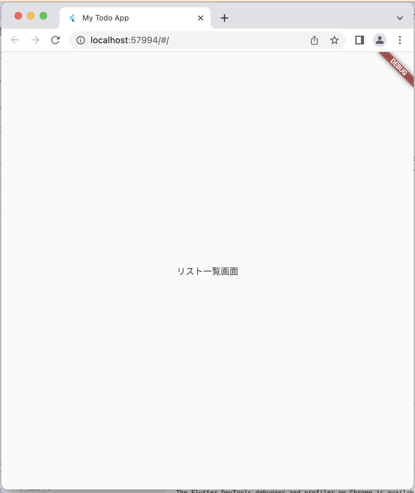

# Todoアプリを作ろう 01

## 01_base

### アプリのベースを作る

#### **【課題】**

- [ ] projectsフォルダを開く
- 「todoapp」という名前でプロジェクトを作成

- [ ] constの警告が出ない設定にする
- analysis_options.yamlの「rules:」にコードを追加

```Dart
  rules:
    prefer_const_constructors: false
```
- [ ] 下記のソースコードを写経
- 最初にmain.dartのコードを全て削除してから書こう

#### **【ポイント】**

- [ ] 入力に慣れる
- [ ] バージョンやOSによって、コードの書き方が異なる場合がある
- [ ] 赤色の波線が出た時・・・エラー・・・入力に誤りがないか確認
- [ ] 緑色の波線が出た時・・・警告・・・エラーではないが正しい記述になっていない
- 波線にカーソルを合わせて、電球アイコンから正しい記述を選択しましょう
- どれを選んだらよいかわからない場合は講師に質問しましょう

#### **【ソースコード】**

```Dart
import 'package:flutter/material.dart';

void main() {
  // 最初に表示するWidget
  runApp(MyTodoApp());
}

class MyTodoApp extends StatelessWidget {
  const MyTodoApp({super.key});

  @override
  Widget build(BuildContext context) {
    return MaterialApp(
      // アプリ名
      title: 'My Todo App',
      theme: ThemeData(
        // テーマカラー
        primarySwatch: Colors.blue,
      ),
      // リスト一覧画面を表示
      home: TodoListPage(),
    );
  }
}

class TodoListPage extends StatelessWidget {
  const TodoListPage({super.key});

  @override
  Widget build(BuildContext context) {
    return Scaffold(
        body: Center(
      child: Text('リスト一覧画面'),
    ));
  }
}
```

#### **【結果】**  

- [ ] 実行して、「リスト一覧」の文字が表示されること  


