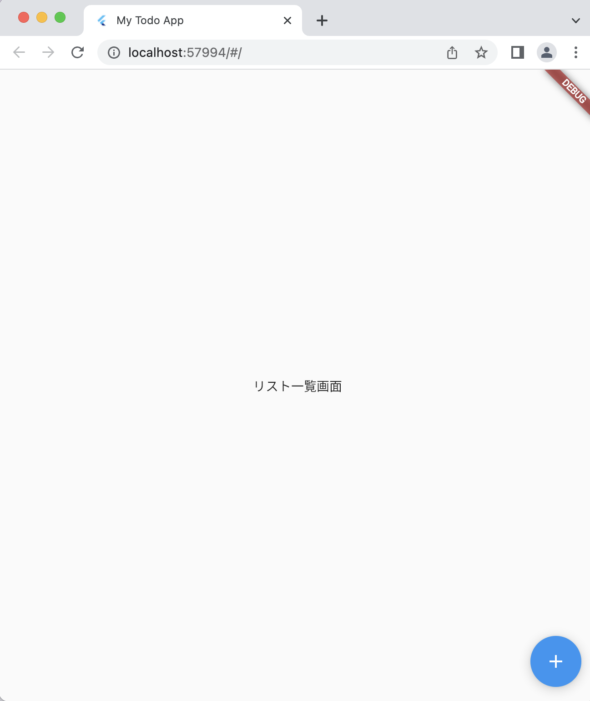

# Todoアプリを作ろう 02

## 02_link

### 遷移ボタンを作る

### 遷移先のベースを作る

#### **【課題】**

- [ ] 下記コードの「//★」の部分を追記
- 追加する部分を確認しながら入力しよう

#### **【ポイント】**

- [ ] ボタンを押したときの処理を、onPress内に記述
- [ ] 画面遷移先のclassを、pushで追加

#### **【解説】**

画面スタック領域（箱みたいなもの）に画面の情報が書き込まれます。PUSHすると画面スタック領域に順番に重なり合うように画面の情報が書き込まれ、この時一番上の画面情報が表示される仕組みです。


#### **【ソースコード】**

```Dart
import 'package:flutter/material.dart';

void main() {
  runApp(MyTodoApp());
}

class MyTodoApp extends StatelessWidget {
  const MyTodoApp({super.key});

  @override
  Widget build(BuildContext context) {
    return MaterialApp(
      title: 'My Todo App',
      theme: ThemeData(
        primarySwatch: Colors.blue,
      ),
      home: TodoListPage(),
    );
  }
}

class TodoListPage extends StatelessWidget {
  const TodoListPage({super.key});

  @override
  Widget build(BuildContext context) {
    return Scaffold(
      body: Center(
        child: Text('リスト一覧画面'),
      ), //★ ①)「,」カンマがなければ追加
      floatingActionButton: FloatingActionButton(
        onPressed: () {
          //★ ②Pushで新規画面に移動
          Navigator.of(context).push(
            MaterialPageRoute(builder: (context) {
              //★ ③遷移先の画面としてリスト追加画面を指定
              return TodoAddPage();
            }),
          );
        },
        //★ ④ボタンを追加
        child: Icon(Icons.add),
      ),
    );
  }
}

//★ ⑤リスト追加画面のベースを作る
class TodoAddPage extends StatelessWidget {
  const TodoAddPage({super.key});

  @override
  Widget build(BuildContext context) {
    return Scaffold(
      body: Center(
        child: Text('リスト一覧画面'),
      ),
    );
  }
}
```

#### **【結果】**  

- [ ] 画面右下にボタンが表示されること


