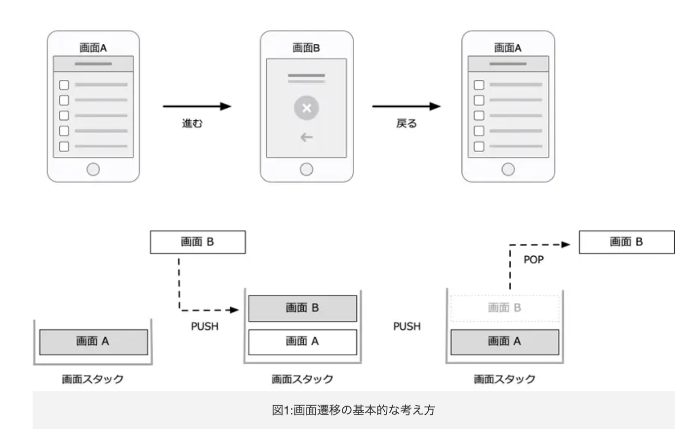
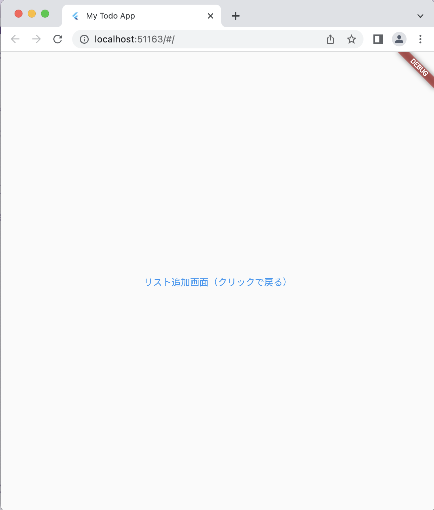

# Todoアプリを作ろう 03

## 03_back

### 遷移元のページに戻る

#### **【課題】**

- [ ] 下記コードの「//★」の部分を追記

#### **【ポイント】**

- [ ] 前の画面に戻るには　popを使う
- PUSHとPOPの仕組みを理解しよう

#### **【解説】**

popはスタック領域の一番上の画面情報を取り出す仕組みです。取り出された後にスタック領域の一番上にある画面情報が表示されます。



#### **【ソースコード】**

```Dart
import 'package:flutter/material.dart';

void main() {
  runApp(MyTodoApp());
}

class MyTodoApp extends StatelessWidget {
  const MyTodoApp({super.key});

  @override
  Widget build(BuildContext context) {
    return MaterialApp(
      title: 'My Todo App',
      theme: ThemeData(
        primarySwatch: Colors.blue,
      ),
      home: TodoListPage(),
    );
  }
}

class TodoListPage extends StatelessWidget {
  const TodoListPage({super.key});

  @override
  Widget build(BuildContext context) {
    return Scaffold(
      body: Center(
        child: Text('リスト一覧画面'),
      ),
      floatingActionButton: FloatingActionButton(
        onPressed: () {
          Navigator.of(context).push(MaterialPageRoute(builder: (context) {
            return TodoAddPage();
          }));
        },
        child: Icon(Icons.add),
      ),
    );
  }
}

class TodoAddPage extends StatelessWidget {
  const TodoAddPage({super.key});

  @override
  Widget build(BuildContext context) {
    return Scaffold(
      body: Center(
          // ★①テキストボタンを配置
          child: TextButton(
        onPressed: () {
          Navigator.of(context).pop();
        },
        // ★②TextButton内にchild: Textを移動し、文字を追加
        child: Text('リスト追加画面（クリックで戻る）'),
      )),
    );
  }
}

```

#### **【結果】**  

- [ ] 「リスト追加画面（クリックで戻る）」ボタンが表示され、クリックすると元の画面に戻ること


