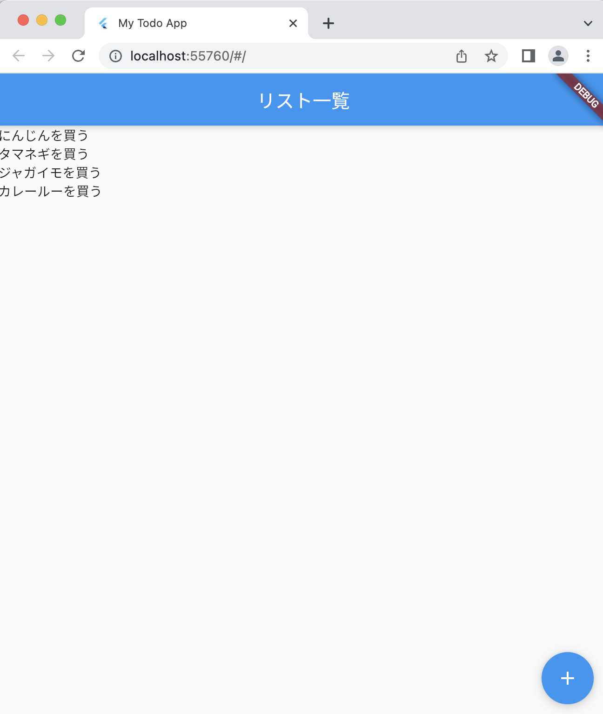

# Todoアプリを作ろう 05

## 05_list

### リスト表示

#### **【課題】**

- [ ] TodoListPage画面をスクロール可能なリスト表示に変更
- 下記の画面と同じ表示になるように修正しましょう

※※難しい場合は、下記ソースコードの「//★」の部分を見ながら追加してみよう


  
#### **【ポイント】**

- [ ] スクロール表示したい場合はListViewを使う
- リスト表示の方法をおさらいしましょう

#### **【ソースコード】**

```Dart
import 'package:flutter/material.dart';

void main() {
  runApp(MyTodoApp());
}

class MyTodoApp extends StatelessWidget {
  const MyTodoApp({super.key});

  @override
  Widget build(BuildContext context) {
    return MaterialApp(
      title: 'My Todo App',
      theme: ThemeData(
        primarySwatch: Colors.blue,
      ),
      home: TodoListPage(),
    );
  }
}


class TodoListPage extends StatelessWidget {
  const TodoListPage({super.key});

  @override
  Widget build(BuildContext context) {
    return Scaffold(
      appBar: AppBar(
        title: Text('リスト一覧'),
      ),
      // ★①Center→ListViewに変更
      body: ListView(
        // ★②childreの中に、配列でTextを入れる
        children: const <Widget>[
          Text('にんじんを買う'),
          Text('タマネギを買う'),
          Text('ジャガイモを買う'),
          Text('カレールーを買う'),
        ],
      ),
      floatingActionButton: FloatingActionButton(
        onPressed: () {
          Navigator.of(context).push(MaterialPageRoute(builder: (context) {
            return TodoAddPage();
          }));
        },
        child: Icon(Icons.add),
      ),
    );
  }
}


class TodoAddPage extends StatelessWidget {
  const TodoAddPage({super.key});

  @override
  Widget build(BuildContext context) {
    return Scaffold(
      body: Center(
        child: TextButton(
          onPressed: () {
            Navigator.of(context).pop();
          },
          child: Text('リスト追加画面（クリックで戻る）'),
        ),
      ),
    );
  }
}
```

#### **【結果】**  

- [ ] リスト表示されること


