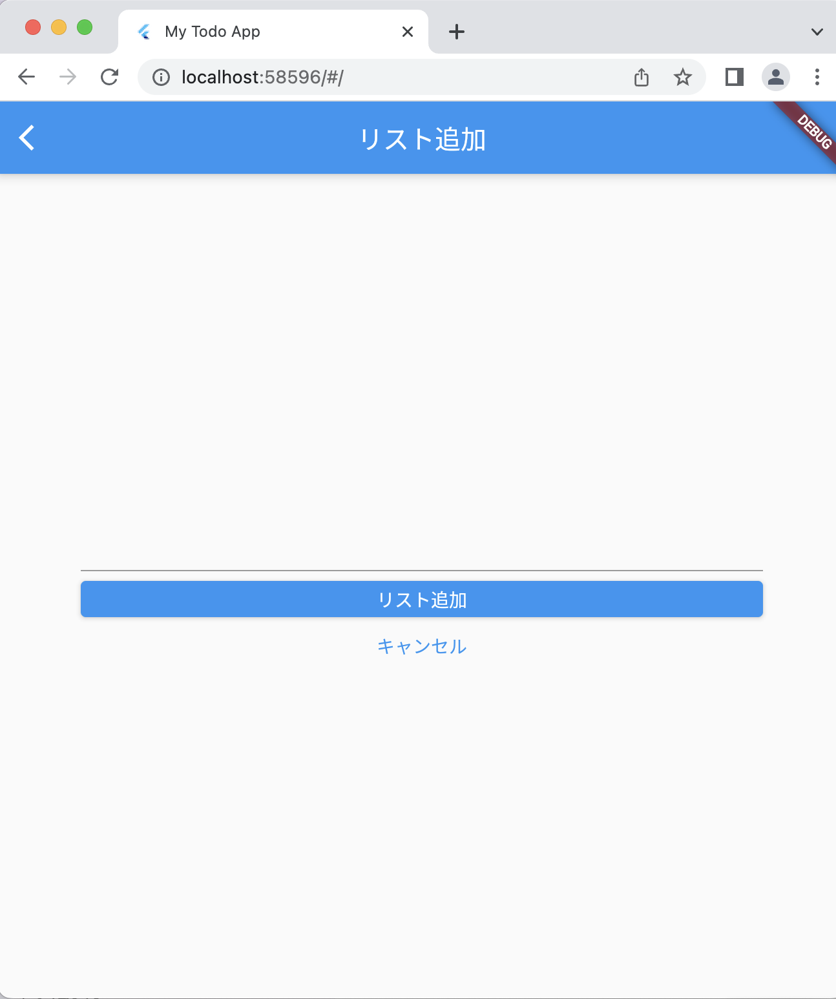

# Todoアプリを作ろう 07

## 07_addpage

### TodoAddPage画面のレイアウトを作成

1. appBarを追加
2. Center→Containerに変更
3. paddingで余白をつける
4. childにColumnを入れる
5. 垂直方向の揃えを中央にする
6. childrenを作り、追加画面を作成
7. 入力するためのテキストフィールドを作る
8. 余白を作成
9. Containerを作る
10. 横幅をいっぱいに設定する
11. リスト追加ボタンを作る
12. 余白を作成
13. Containerを作る
14. キャンセルボタンを作る
15. 文字の変更

#### **【課題】**

- [ ] 下記コードの「//★」の部分を追記
  
#### **【ポイント】**

- 「どのClass（ページ）を操作しているのか？」や「何を作っているのか？」を意識して書こう！
  
#### **【ソースコード】**

```Dart
import 'package:flutter/material.dart';

void main() {
  runApp(MyTodoApp());
}

class MyTodoApp extends StatelessWidget {
  const MyTodoApp({super.key});

  @override
  Widget build(BuildContext context) {
    return MaterialApp(
      title: 'My Todo App',
      theme: ThemeData(
        primarySwatch: Colors.blue,
      ),
      home: TodoListPage(),
    );
  }
}

class TodoListPage extends StatelessWidget {
  const TodoListPage({super.key});

  @override
  Widget build(BuildContext context) {
    return Scaffold(
      appBar: AppBar(
        title: Text('リスト一覧'),
      ),
      body: ListView(
        children: const <Widget>[
          Card(
            child: ListTile(
              title: Text('にんじんを買う'),
            ),
          ),
          Card(
            child: ListTile(
              title: Text('タマネギを買う'),
            ),
          ),
          Card(
            child: ListTile(
              title: Text('ジャガイモを買う'),
            ),
          ),
          Card(
            child: ListTile(
              title: Text('カレールーを買う'),
            ),
          ),
        ],
      ),
      floatingActionButton: FloatingActionButton(
        onPressed: () {
          Navigator.of(context).push(
            MaterialPageRoute(builder: (context) {
              return TodoAddPage();
            }),
          );
        },
        child: Icon(Icons.add),
      ),
    );
  }
}

class TodoAddPage extends StatelessWidget {
  const TodoAddPage({super.key});

  @override
  Widget build(BuildContext context) {
    return Scaffold(
      // ★①appBarを追加
      appBar: AppBar(
        title: Text('リスト追加'),
      ),
      // ★②Center→Containerに変更
      body: Container(
        // ★③paddingで余白をつける
        padding: EdgeInsets.all(60),
        // ★④childにColumnを入れる
        child: Column(
          // ★⑤垂直方向の揃えを中央にする
          mainAxisAlignment: MainAxisAlignment.center,
          // ★⑥childrenを作り、追加画面を作成
          children: [
            // ★⑦入力するためのテキストフィールドを作る
            TextField(),
            // ★⑧余白を作成
            SizedBox(height: 8),
            // ★⑨Containerを作る
            Container(
              // ★⑩横幅をいっぱいに設定する
              width: double.infinity,
              // ★11.リスト追加ボタンを作る
              child: ElevatedButton(
                onPressed: () {},
                child: Text(
                  'リスト追加',
                  style: TextStyle(color: Colors.white),
                ),
              ),
            ),
            // ★12.余白を作成
            SizedBox(height: 8),
            // ★13.Containerを作る
            Container(
                // ★14.キャンセルボタンを作る
                width: double.infinity,
                child: TextButton(
                  onPressed: () {
                    Navigator.of(context).pop();
                  },
                  // ★15.文字の変更
                  child: Text('キャンセル'),
                ))
          ],
        ),
      ),
    );
  }
}
```

#### **【結果】**  

- [ ] AppBer、リスト入力、リスト追加ボタンが表示されること
- [ ] 入力項目に文字が入力できること


