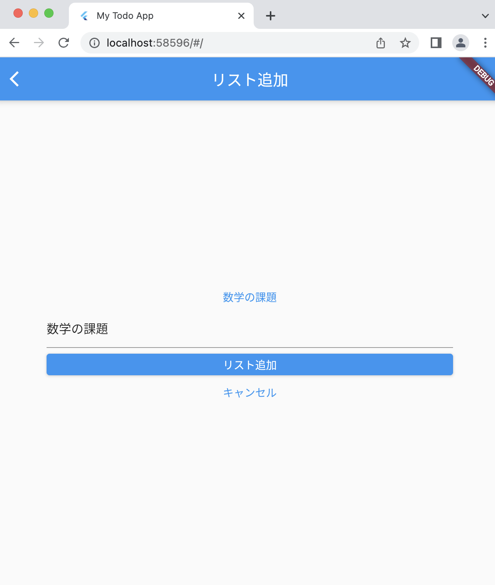

# Todoアプリを作ろう 09

## 09_text

### テキスト入力された時の処理

1. 入力されたテキストを表示
2. TextFieldのonChangeからテキストを受け取る

#### **【課題】**

- [ ] 下記コードの「//★」の部分を追記
  
#### **【ポイント】**

- 変数に変更を与えるきっかけと、出力される動作を学ぼう！
  
#### **【ソースコード】**

```Dart
import 'package:flutter/material.dart';

void main() {
  runApp(MyTodoApp());
}

class MyTodoApp extends StatelessWidget {
  const MyTodoApp({super.key});

  @override
  Widget build(BuildContext context) {
    return MaterialApp(
      title: 'My Todo App',
      theme: ThemeData(
        primarySwatch: Colors.blue,
      ),
      home: TodoListPage(),
    );
  }
}

class TodoListPage extends StatelessWidget {
  const TodoListPage({super.key});

  @override
  Widget build(BuildContext context) {
    return Scaffold(
      appBar: AppBar(
        title: Text('リスト一覧'),
      ),
      body: ListView(
        children: const <Widget>[
          Card(
            child: ListTile(
              title: Text('にんじんを買う'),
            ),
          ),
          Card(
            child: ListTile(
              title: Text('タマネギを買う'),
            ),
          ),
          Card(
            child: ListTile(
              title: Text('ジャガイモを買う'),
            ),
          ),
          Card(
            child: ListTile(
              title: Text('カレールーを買う'),
            ),
          ),
        ],
      ),
      floatingActionButton: FloatingActionButton(
        onPressed: () {
          Navigator.of(context).push(
            MaterialPageRoute(builder: (context) {
              return TodoAddPage();
            }),
          );
        },
        child: Icon(Icons.add),
      ),
    );
  }
}

class TodoAddPage extends StatefulWidget {
  const TodoAddPage({super.key});

  @override
  _TodoAddPageState createState() => _TodoAddPageState();
}

class _TodoAddPageState extends State<TodoAddPage> {
  // ★①変数「_text」を宣言
  String _text = '';

  @override
  Widget build(BuildContext context) {
    return Scaffold(
      appBar: AppBar(
        title: Text('リスト追加'),
      ),
      body: Container(
        padding: EdgeInsets.all(60),
        child: Column(
          mainAxisAlignment: MainAxisAlignment.center,
          children: [
            // ★②テキストフィールドに入力されたテキストを表示する場所を作る
            Text(_text, style: TextStyle(color: Colors.blue)),
            // ★③余白を作る
            SizedBox(height: 8),

            //　★④テキストフィールドの設定
            TextField(
              // ★⑤入力が変わったら、その度にテキストの値を受け取る
              onChanged: (String value) {
                setState(() {
                  _text = value;
                });
              },
            ),
            SizedBox(height: 8),
            Container(
              width: double.infinity,
              child: ElevatedButton(
                onPressed: () {},
                child: Text(
                  'リスト追加',
                  style: TextStyle(color: Colors.white),
                ),
              ),
            ),
            SizedBox(height: 8),
            Container(
                width: double.infinity,
                child: TextButton(
                  onPressed: () {
                    Navigator.of(context).pop();
                  },
                  child: Text('キャンセル'),
                ))
          ],
        ),
      ),
    );
  }
}

```

#### **【結果】**

- [ ] 入力したテキストが入力フィールドの上に表示されること


