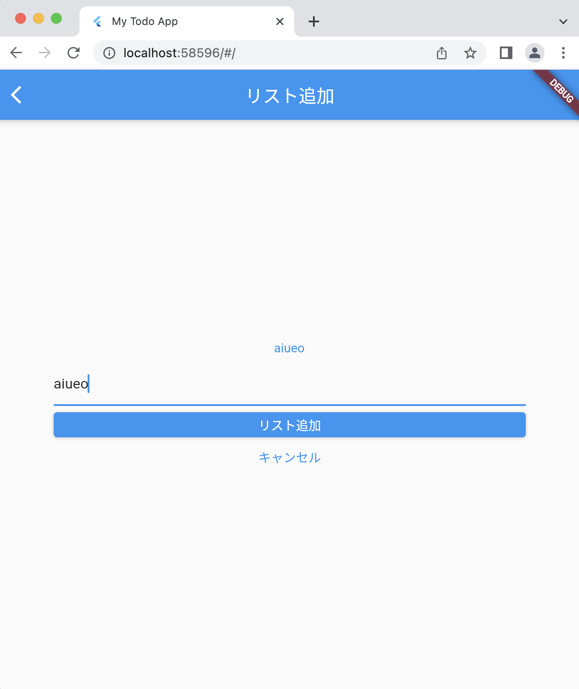
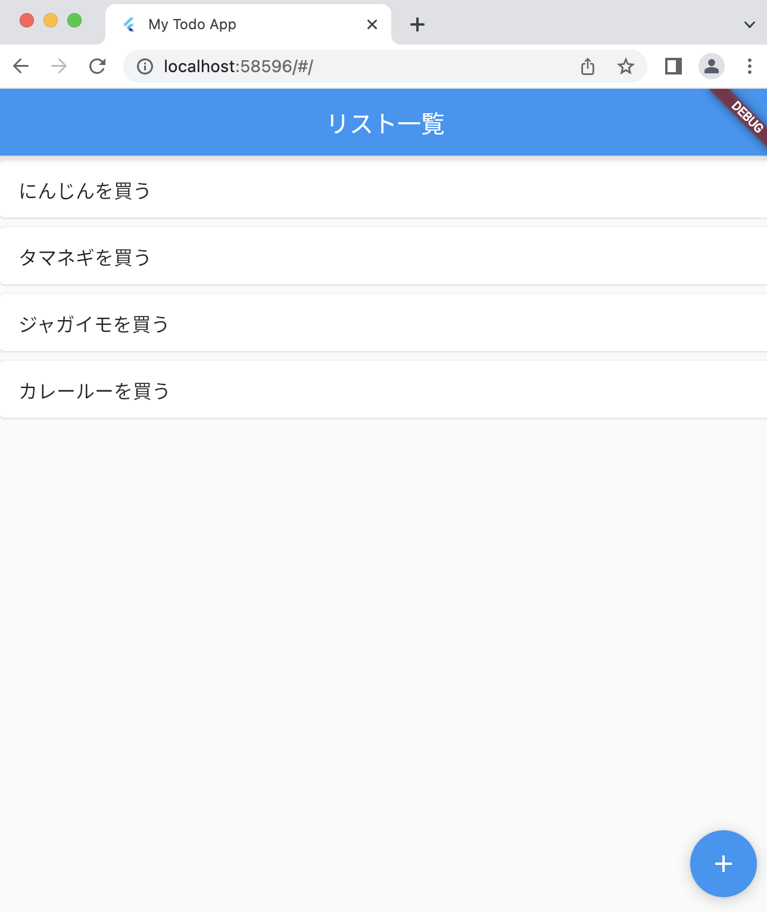

# Todoアプリを作ろう 10

## 10_datasend

### データの受け渡し

1. 入力されたテキストデータを引数として前の画面に渡す
2. 前の画面でデータを受け取る

#### **【課題】**

- [ ] 下記コードの「//★」の部分を追記
  
#### **【ポイント】**

- いまは完璧に理解せずとも大丈夫！データが運ばれる動きは追ってみよう
  
#### **【ソースコード】**

```Dart
import 'package:flutter/material.dart';

void main() {
  runApp(MyTodoApp());
}

class MyTodoApp extends StatelessWidget {
  const MyTodoApp({super.key});

  @override
  Widget build(BuildContext context) {
    return MaterialApp(
      title: 'My Todo App',
      theme: ThemeData(
        primarySwatch: Colors.blue,
      ),
      home: TodoListPage(),
    );
  }
}

class TodoListPage extends StatelessWidget {
  const TodoListPage({super.key});

  @override
  Widget build(BuildContext context) {
    return Scaffold(
      appBar: AppBar(
        title: Text('リスト一覧'),
      ),
      body: ListView(
        children: const <Widget>[
          Card(
              child: ListTile(
            title: Text('にんじんを買う'),
          )),
          Card(
              child: ListTile(
            title: Text('タマネギを買う'),
          )),
          Card(
              child: ListTile(
            title: Text('ジャガイモを買う'),
          )),
          Card(
              child: ListTile(
            title: Text('カレールーを買う'),
          )),
        ],
      ),
      floatingActionButton: FloatingActionButton(
        // ★①asyncを追加し、リスト追加画面から渡された値を受け取る
        onPressed: () async {
          // ★②定数newListTextを作り、awaitを追加。
          // pushした時、テキストフィールドに入っている値が代入される
          final newListText = await Navigator.of(context)
              .push(MaterialPageRoute(builder: (context) {
            return TodoAddPage();
          }));
        },
        child: Icon(Icons.add),
      ),
    );
  }
}

class TodoAddPage extends StatefulWidget {
  const TodoAddPage({super.key});

  @override
  _TodoAddPageState createState() => _TodoAddPageState();
}

class _TodoAddPageState extends State<TodoAddPage> {
  String _text = '';

  @override
  Widget build(BuildContext context) {
    return Scaffold(
      appBar: AppBar(
        title: Text('リスト追加'),
      ),
      body: Container(
        padding: EdgeInsets.all(60),
        child: Column(
          mainAxisAlignment: MainAxisAlignment.center,
          children: [
            Text(_text, style: TextStyle(color: Colors.blue)),
            SizedBox(height: 8),
            TextField(
              onChanged: (String value) {
                setState(() {
                  _text = value;
                });
              },
            ),
            SizedBox(height: 8),
            Container(
              width: double.infinity,
              child: ElevatedButton(
                onPressed: () {
                  // ★③{}の中を改行し、値を渡す設定を追加
                  Navigator.of(context).pop(_text);
                },
                child: Text(
                  'リスト追加',
                  style: TextStyle(color: Colors.white),
                ),
              ),
            ),
            SizedBox(height: 8),
            Container(
                width: double.infinity,
                child: TextButton(
                  onPressed: () {
                    Navigator.of(context).pop();
                  },
                  child: Text('キャンセル'),
                ))
          ],
        ),
      ),
    );
  }
}

```

#### **【結果】**

- [ ] リスト追加ボタンを押すと、前の画面に戻ること



